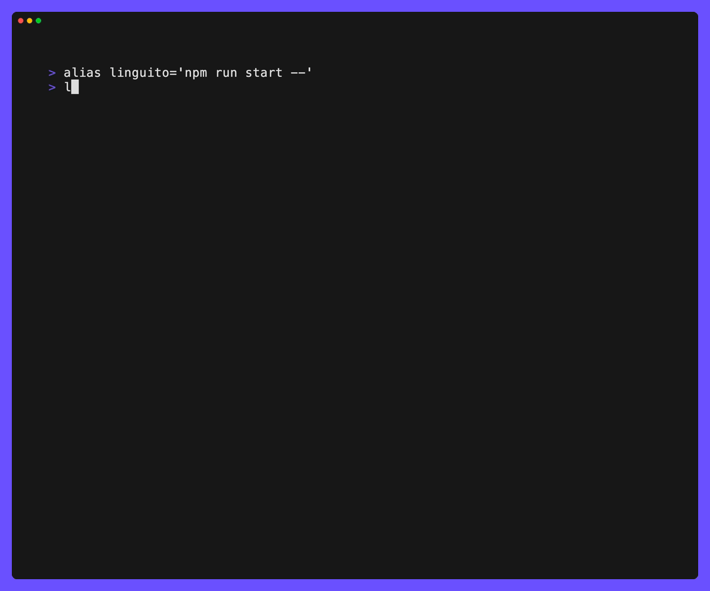

# Linguito

Linguito is a CLI tool designed to enhance the capabilities of [Lingui](https://lingui.dev/). It provides advanced utilities to ensure smooth internationalization (i18n) workflows, making it a great companion for managing translations in your project.



## Usage

### `linguito check`

Verifies your project's translation files to ensure all translations are complete. It scans the catalog files defined in `lingui.config.js` and reports any missing translations in the format `<file>:"<missing_key>"`.

#### Examples

```shell
# By default, linguito check looks for a lingui config file in the current directory
linguito check

# Or you can specify your project's directory
linguito check ~/Development/my-app
```

### `linguito config`

Manage Linguito's configuration settings for advanced customization. The `config` command allows you to view and update the CLI's configuration in both interactive and programmatic ways.

#### Examples

```shell
# If no other subcommand is used, this will start an interactive session to change config values
linguito config

# You can also read a specific config value
linguito config get llmSettings.provider

# Or set config values
linguito config set llmSettings.provider=ollama llmSettings.url=http://127.0.0.1:1234/v1
```

### `linguito translate`

Helps you identify and resolve missing translations in your project's `.po` catalog files. It scans the translation files defined in your Lingui configuration (`lingui.config.js`) and either prompts you to fill in missing translations interactively or utilizes a configured LLM (Large Language Model) to automatically translate them for you. You can also combine these approaches by reviewing AI-suggested translations interactively.

#### Examples

```shell
# Start an interactive session to fill the missing translations found in the project
linguito translate ~/Development/my-app --interactive

# You can also let the configured LLM fill the translations for you
linguito translate ~/Development/my-app --llm

# Or you can start an interactive session with translations suggested by the LLM
linguito translate ~/Development/my-app --llm --interactive
```


## Development

This project is built with [oclif](https://oclif.io/) and [Typescript](https://www.typescriptlang.org/).

### Commands

Here is a list of useful commands to use and develop this tool locally:
- `npm run start -- {command}` - Runs linguito locally
- `npm run lint` - Validate lint rules
- `npm run test` - Runs all tests
- `npm run test:watch` - Runs all tests and watches for changes to rerun them when they happen
